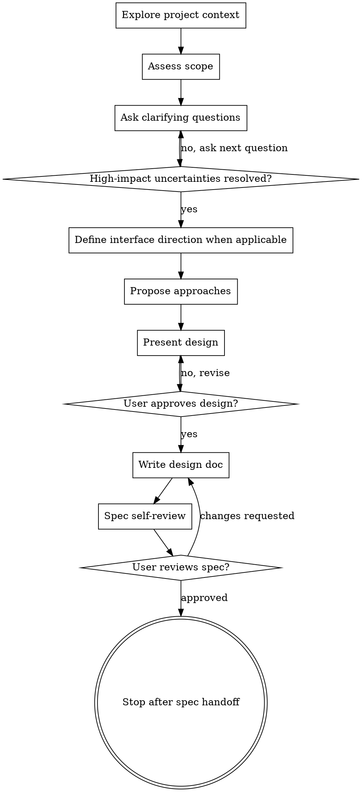

# Brainstorming Ideas Into Designs

Help turn ideas into clear designs and implementation-ready specs through collaborative dialogue.

**Manual trigger only:** Do not use this skill unless the user explicitly invokes `/brainstorming` or explicitly asks to use the brainstorming skill by name.

Start by understanding the current project context, then clarify the idea, compare approaches, present the design, write the spec, and stop for user review.

<MANUAL-TRIGGER>
This skill does not apply automatically. If the user does not explicitly invoke `/brainstorming` or explicitly request this skill, continue with the normal workflow for the task.
</MANUAL-TRIGGER>

## Anti-Pattern: "This Is Too Simple To Need A Design"

Do not auto-apply this process to every project. If the user has not explicitly requested brainstorming, do not force a design phase, extra clarifying loop, or design document.

## Checklist

Track the following stages in order. If the current environment provides a planning or task-tracking tool, represent them as plan items; otherwise follow the checklist directly:

1. **Explore project context** - check files, docs, and recent commits when available.
2. **Assess scope** - decompose oversized requests before refining details.
3. **Ask clarifying questions** - ask one direction-changing question at a time, optionally batch 2-3 independent factual questions, wait for the answer, update the inferred requirement model, and continue until all high-impact uncertainties are resolved.
4. **Define the interface direction when applicable** - for user-facing work, make the user journey, information hierarchy, visual system, interaction states, responsive behavior, and one justified signature element explicit.
5. **Compare approaches** - normally propose 2-3 approaches with trade-offs and a recommendation; if only one approach is reasonable, explain why alternatives would not be credible.
6. **Present design** - scale confirmation to complexity: one overall approval for small designs, section-by-section approval for complex designs.
7. **Write design doc** - save it in the project's existing spec/docs location, or use the fallback path below. Preserve approved UI decisions as an implementation-facing interface design contract.
8. **Spec self-review** - check placeholders, contradictions, ambiguity, scope, security, boundaries, dependencies, UI traceability, and unrequested features.
9. **User reviews written spec** - ask the user to review the spec before proceeding.
10. **Stop after spec handoff** - continue only if the user explicitly asks for planning or implementation.

## Confidence Criteria

Clarification is complete when every unanswered question that could materially change the architecture, scope, core workflow, recommended approach, or success criteria has been resolved. The following should be clear enough for the task scope:

- User's real objective and the problem being solved.
- Target users or actors.
- Expected deliverable: project, module, feature, design, plan, code change, or artifact.
- Core workflows and required behavior.
- Important constraints: tech stack, repository conventions, platform, data model, integrations, timeline, style, performance, security, compliance, or compatibility.
- Definition of done and success criteria.
- Known non-goals or boundaries.
- For user-facing work: primary journeys, content hierarchy, interaction states, responsive priorities, accessibility expectations, visual direction, and asset constraints.

If some criteria are irrelevant or already obvious from context, do not ask about them. If a reasonable assumption is low-risk, state it in the final summary instead of prolonging the interview.

## Process Flow



**The terminal state is stopping after the spec handoff.** Do not automatically invoke `writing-plans`, commit files, or start implementation unless the user explicitly asks for it.

## The Process

**Understanding the idea:**

- Check the current project state first: files, docs, conventions, and recent commits. If the directory is not a Git repository or has no commit history, skip the commit check and rely on the available files and project documentation.
- Before asking detailed questions, assess scope. If the request describes multiple independent subsystems, flag this immediately.
- If the project is too large for one spec, help the user decompose it into sub-projects, choose the first sub-project, and brainstorm only that piece through the normal design flow.
- Ask one direction-changing question per message, wait for the user's answer, update the inferred requirement model, and repeat. You may batch 2-3 short, independent factual questions when their answers do not affect one another and answering them together will not overload the user.
- Ask the highest-impact unknown first: direction-changing ambiguity, core workflow choices, technical constraints, edge cases and success criteria, then polish preferences.
- Make each question concrete and answerable. Prefer multiple choice when the known options are clear; use open-ended questions only when the answer space is not clear.
- Do not propose approaches, design, implementation plans, code, file edits, or detailed recommendations until the design direction is clear enough to proceed without likely rework.
- Treat "clear enough to proceed" as meaning there is no known unanswered question likely to change the recommended approach, architecture, main workflow, scope boundary, or success criteria.
- Before moving on, satisfy the Confidence Criteria above and be able to summarize any remaining low-risk assumptions.
- If a remaining assumption is low-risk, state it later as an explicit assumption instead of prolonging the interview. If the assumption could change the design direction, ask about it before proposing approaches.
- If the user asks to proceed early, ask one final blocking question unless the remaining uncertainty is genuinely low-risk. If the user explicitly says to assume the rest, proceed with clearly labeled assumptions.
- Focus on purpose, constraints, success criteria, users, integration points, data, error cases, and non-goals.

**Exploring approaches:**

- Normally propose 2-3 genuinely different approaches with trade-offs. Do not invent artificial alternatives: if project constraints or established conventions leave only one credible approach, present it and briefly explain why the apparent alternatives are unsuitable.
- Lead with your recommended option and explain why.
- Include enough detail to choose between options, but avoid implementing the design during brainstorming.

**Presenting the design:**

- Once you understand what is being built, present the design.
- Scale each section to complexity: a few sentences if straightforward, up to 200-300 words if nuanced.
- For small designs, ask for one overall approval.
- For complex designs, ask for approval after meaningful sections such as architecture, data model, workflow, integration, or testing.
- Cover architecture, components, data flow, error handling, testing, and rollout when relevant.
- Go back and clarify whenever a design choice depends on an unresolved assumption.

## Interface Design Track

Apply this track only when the work creates or materially changes a user-facing interface. Do not force visual design work into backend-only, infrastructure, data, or internal refactoring requests.

### Ground the interface in the product

- Name the concrete subject, target user, usage context, and the interface's single most important job.
- Inspect existing screens, design tokens, components, brand assets, content, and interaction conventions before proposing a new direction.
- Derive visual choices from the product's domain, content, tools, materials, and audience. Do not begin from a fashionable style label and retrofit the product into it.
- Separate product and UX decisions from visual styling. Resolve navigation, hierarchy, workflows, and states before polishing appearance.

### Explore credible interface directions

- When the visual direction is open, compare 2-3 genuinely distinct directions. For each, describe the layout idea, visual character, signature element, implementation cost, accessibility implications, and fit with the product.
- Recommend one direction and explain why it serves this product and audience better than the alternatives.
- Avoid generic AI defaults unless the brief specifically calls for them. Examples include interchangeable dashboard cards, decorative gradients, arbitrary numbered sections, excessive rounded containers, and animation without a user-facing purpose.
- Spend visual boldness in one place. Choose one memorable, justifiable signature element and keep supporting elements disciplined.

### Define the interface design contract

Before approving a user-facing design, make the following decisions explicit at the level needed for implementation:

- **Experience goal:** what the user should understand, feel, and accomplish.
- **Primary journeys:** entry points, key actions, decision points, success paths, and recovery paths.
- **Information architecture:** page or screen structure, navigation model, content priority, and progressive disclosure.
- **Layout:** composition, grid, density, spacing rhythm, fixed-format regions, and mobile/desktop adaptation. Use a compact ASCII wireframe when spatial relationships are important.
- **Visual direction:** product-specific rationale, mood, contrast strategy, and the single signature element.
- **Design tokens:** 4-6 named color roles with values when appropriate, typography roles, type scale, spacing, radii, borders, shadows, and motion principles. Reuse the project's existing tokens when they are established.
- **Components and controls:** component hierarchy, repeated patterns, control types, icon strategy, and ownership boundaries. Use familiar controls for familiar actions.
- **Content design:** terminology, labels, calls to action, empty states, validation, errors, confirmations, and tone. Use the user's language rather than implementation terminology.
- **Interaction states:** default, hover, focus, active, selected, disabled, loading, empty, error, success, and destructive confirmation where relevant.
- **Responsive behavior:** what reflows, collapses, scrolls, remains fixed, or changes priority at representative mobile and desktop widths.
- **Accessibility:** semantic structure, keyboard flow, visible focus, contrast, reduced motion, labels, and touch target expectations.
- **Asset strategy:** real product imagery, illustrations, icons, charts, generated assets, or no imagery; include source and fallback expectations.
- **Visual verification:** representative routes, states, viewport sizes, and screenshots or browser checks required to judge implementation fidelity.

Do not leave consequential design choices as adjectives such as "modern," "clean," or "premium." Translate them into observable layout, typography, color, content, and interaction decisions. Do not prescribe arbitrary pixel values when an existing design system should own them.

**Design for isolation and clarity:**

- Break the system into smaller units with one clear purpose, well-defined interfaces, and independent testability.
- For each unit, be able to answer: what it does, how to use it, and what it depends on.
- A reader should understand a unit's behavior without reading its internals. If not, the boundary needs work.
- Include targeted cleanup only when existing code problems directly affect the proposed work.
- Do not propose unrelated refactoring.

**Working in existing codebases:**

- Explore the current structure before proposing changes.
- Follow existing patterns, naming, frameworks, and helper APIs unless there is a concrete reason not to.
- Respect project-specific docs/spec paths and user preferences over the fallback path.

## Writing the Spec

**Location:**

- Prefer the project's existing spec, design, ADR, or docs location.
- If no project convention exists, write to `docs/specs/YYYY-MM-DD-<topic>-design.md`.
- Do not commit the design document unless the user explicitly asks you to commit.

**Template:**

Use this structure unless the project already has a stronger spec template:

```markdown
# <Feature or Project Name> Design

## Context
Briefly describe the current system, the problem, and why this work matters.

## Goals
- Concrete outcome the implementation must achieve.

## Non-Goals
- Related work that is intentionally out of scope.

## Recommended Approach
Summarize the selected approach and why it was chosen over alternatives.

## Alternatives Considered
| Approach | Pros | Cons | Decision |
|----------|------|------|----------|
| <name> | <pros> | <cons> | <chosen/rejected reason> |

## Architecture
Describe the high-level design, key modules, ownership boundaries, and integration points.

## Interface Design Contract
Include this section only for user-facing work.

### Experience and Journeys
Describe the target user, interface job, primary journeys, information hierarchy, and recovery paths.

### Layout and Responsive Behavior
Describe screen structure, layout rules, density, priority changes, and representative mobile/desktop behavior. Include a compact wireframe when useful.

### Visual System
Record the approved visual direction and rationale, signature element, color roles, typography roles, spacing, shape, border, shadow, icon, imagery, and motion decisions. Prefer existing project tokens where applicable.

### Components, Content, and States
List key components and controls, important labels and messages, and required default, focus, loading, empty, error, success, disabled, and confirmation states.

### Accessibility and Visual Verification
State keyboard, focus, semantics, contrast, reduced-motion, touch-target, viewport, route, screenshot, and interaction checks required for acceptance.

## Components
| Component | Responsibility | Depends On | Notes |
|-----------|----------------|------------|-------|
| <name> | <what it does> | <dependencies> | <important constraints> |

## Data Flow
Describe how data, control, or user actions move through the system.

## Error Handling
List expected failure modes and how the system should respond.

## Security
Describe relevant trust boundaries, authorization, data exposure, secret handling, input validation, and abuse cases.

## Boundaries and Dependencies
Describe what each major unit owns, what it must not own, which internal/external dependencies it relies on, and which assumptions those dependencies introduce.

## Testing
Describe unit, integration, end-to-end, fixture, or manual verification coverage.

## Rollout
Describe migration, compatibility, feature flag, deployment, or rollback concerns when relevant.

## Blocking Questions
- Decisions that must be resolved before implementation planning. This section must be empty or omitted before the spec is handed off as planning-ready.

## Deferred Questions
- Non-blocking decisions that may safely be resolved during implementation planning or implementation, including the default assumption to use until then.
```

Omit sections that truly do not apply, but do not leave empty headings.

## Spec Self-Review

After writing the spec, review it with fresh eyes and fix issues inline:

1. **Placeholder scan:** Remove or resolve "TBD", "TODO", empty headings, and vague requirements.
2. **Internal consistency:** Ensure architecture, components, data flow, and tests describe the same design.
3. **Scope check:** Confirm the spec is focused enough for one implementation effort.
4. **Ambiguity check:** If a requirement can be interpreted two ways, pick one, record a safe default as a deferred question, or mark it as a blocking question. Resolve every blocking question before calling the spec planning-ready.
5. **Security check:** Identify relevant trust boundaries, authorization rules, sensitive data exposure, input validation, secret handling, and abuse cases. If security is not relevant, state why briefly.
6. **Boundary check:** Ensure each major unit has a clear responsibility, ownership boundary, and public interface. Fix overlap, hidden coupling, or unclear handoffs.
7. **Dependency check:** Ensure internal modules, external services, libraries, runtime assumptions, configuration, and data dependencies are explicit. Classify unresolved dependency decisions as blocking or deferred, and include a safe default for every deferred decision.
8. **Interface traceability check:** For user-facing work, ensure every approved journey, layout rule, token decision, component state, responsive behavior, accessibility requirement, and visual verification target is explicit enough to enter an implementation plan. Remove generic visual adjectives that have no observable meaning.
9. **Design coherence check:** Confirm the visual system comes from the product and audience, the signature element is intentional, decorative choices serve the brief, and content terminology remains consistent across controls and feedback.
10. **YAGNI check:** Remove unrequested features and over-engineered machinery.

If `spec-document-reviewer-prompt.md` is available, it may be used as a local self-review checklist. Do not delegate the review or block handoff on optional review machinery.

## User Review Gate and Stop Conditions

After the spec review loop passes, ask the user to review the written spec before proceeding:

> "Spec written to `<path>`. Please review it and let me know if you want any changes."

Then stop the brainstorming flow.

If the user does not review or does not respond, do not continue automatically. Leave the spec as the handoff artifact.

If the user asks to "just implement", "skip the review", or otherwise move directly to execution:

- Acknowledge that brainstorming is complete enough to exit.
- Do not continue under the brainstorming skill.
- Proceed only according to the user's explicit next request and the normal workflow for planning or implementation.
- Use `writing-plans` only if the user explicitly asks for planning or if the active instructions for the session require it.

If the user requests spec changes, update the spec, re-run the self-review, and ask for review again.

## Key Principles

- **Manual trigger only** - Do not impose this workflow unless the user requested it.
- **Minimum useful questions** - Clarify what matters without turning every idea into an interview.
- **Multiple choice preferred** - Easier to answer than open-ended when choices are known.
- **YAGNI ruthlessly** - Remove unnecessary features from all designs.
- **Explore credible alternatives** - Normally compare 2-3 approaches, but explain the constraint instead of inventing alternatives when only one approach is credible.
- **Scale validation to complexity** - Use lightweight approval for simple designs and section approval for complex designs.
- **Stop at handoff** - The written spec is the terminal artifact unless the user explicitly asks for the next step.

