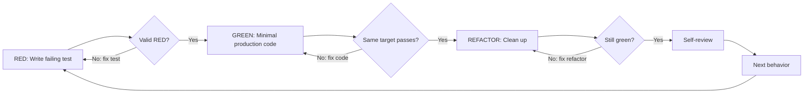

# Test-Driven Development

## Overview

Write the test first. Watch it fail for the right reason. Write the smallest production change that makes it pass. Refactor only while tests stay green.

**Core principle:** If you did not watch the test fail, you do not know whether it tests the behavior you intended.

## When to Use

Use this for:

- New features
- Bug fixes
- Refactoring with behavior risk
- API, UI, CLI, data, or integration behavior changes
- Regression fixes for known bugs

Reasonable exceptions exist, but they must be explicit:

- Pure documentation changes
- Formatting-only changes
- Generated code that should not be hand-edited
- Throwaway exploration or spike work that will be discarded
- Project setup work where the immediate task is creating the first test harness
- Configuration changes that cannot be tested directly, provided another verification path is recorded

If an exception applies, state the exception and the replacement verification before editing production code.

Apply the discipline at the right depth:

- Behavior logic, APIs, data transformations, permissions, and bug fixes require a valid RED before production changes.
- Refactors with behavior risk should start with characterization or regression tests that protect existing behavior.
- Visual/UI polish can use DOM assertions, accessibility checks, Playwright screenshots, visual regression, or documented manual verification when a meaningful RED is not practical.
- Configuration, build, or environment changes can use targeted command verification when they cannot be tested directly.

## Discover Project Test Conventions

Before writing tests, inspect the project enough to use its existing conventions:

- Test docs, README instructions, and existing test examples
- Test framework and runner
- Test file naming and location
- Focused test command
- Broader regression command
- Coverage command and configured thresholds, if any
- Existing fixtures, factories, mocks, test utilities, and E2E tools
- CI commands if local scripts are unclear
- Common project command sources such as `package.json`, `pyproject.toml`, `pytest.ini`, `Makefile`, task runner config, and `.github/workflows`

Use project-specific commands when discoverable. Do not invent `npm test` or any other command when the project uses something else.

## The TDD Rule

```
NO PRODUCTION BEHAVIOR CHANGE WITHOUT A VALID RED FIRST
```

If a production behavior change was written before the test, do not keep adapting that code as "reference." Discard it and restart from the test only when you can prove the change was created by you, is cleanly separable, and can be removed without touching user work. Otherwise isolate your change as much as possible and ask the user whether to continue with a non-TDD recovery path. Never revert or overwrite mixed user changes to restore TDD order.

Do not create commits as part of this skill unless the user explicitly asks for commits.

Examples in this skill are illustrative. Follow the project's language, test framework, and naming conventions instead of copying TypeScript or Jest patterns blindly.

## Red-Green-Refactor



## Behavior-Preserving Refactor Path

A refactor that intentionally preserves behavior does not need an artificial RED. Use this path instead:

1. Identify the behavior and boundaries that must remain unchanged.
2. Run the smallest relevant existing tests and establish a GREEN baseline.
3. If coverage is insufficient, add characterization tests that describe current behavior and verify that they pass before refactoring.
4. Refactor in small steps, rerunning the focused tests after each meaningful change.
5. Run the relevant broader regression checks before completion.

If the refactor introduces or intentionally changes behavior, stop the refactor path and start a normal RED-GREEN-REFACTOR cycle for that behavior. Do not manufacture a failing test for a behavior-preserving refactor.

## RED - Write the Failing Test

Write one minimal test for one behavior. A good RED test:

- Has a clear behavior name.
- Exercises the public API, user-visible behavior, or module boundary.
- Fails without the intended production change.
- Is newly added or changed, or is an existing focused test that precisely reproduces the target defect.
- Avoids mocks unless the dependency is external, slow, nondeterministic, unsafe, or irrelevant to the behavior under test.
- Covers a meaningful success, error, boundary, security, or regression case.

Prefer tests that describe desired behavior rather than implementation details.

<Good>

```typescript
test('retries failed operations three times before succeeding', async () => {
  let attempts = 0;
  const operation = async () => {
    attempts += 1;
    if (attempts < 3) throw new Error('temporary failure');
    return 'success';
  };

  await expect(retryOperation(operation)).resolves.toBe('success');
  expect(attempts).toBe(3);
});
```

</Good>

<Bad>

```typescript
test('retry works', async () => {
  const mock = jest.fn()
    .mockRejectedValueOnce(new Error())
    .mockRejectedValueOnce(new Error())
    .mockResolvedValueOnce('success');

  await retryOperation(mock);

  expect(mock).toHaveBeenCalledTimes(3);
});
```

</Bad>

The bad test is vague and mostly checks mock interaction. If interaction is the behavior, make that explicit; otherwise test the result that matters.

## Verify RED - Watch It Fail Correctly

This is mandatory for production behavior changes.

Run the focused test target and confirm a valid RED state through one of these paths:

**Runtime RED:**

- The relevant test target compiles or loads successfully.
- The intended test is actually executed, whether it is new, changed, or an existing focused reproducer.
- The result is RED.
- The failure is caused by the intended missing behavior, bug, or unsupported case.

**Compile-time RED:**

- The intended test instantiates, references, or exercises the missing API or buggy code path.
- The compile/type failure is the intended RED signal.
- The failure is not caused by unrelated syntax errors, missing dependencies, or broken test setup.

A valid RED is not:

- A test that was written but never run.
- A test that passes immediately.
- A syntax error.
- A missing import unrelated to the intended behavior.
- A broken fixture, missing dependency, or unrelated regression.
- A failure from an unrelated test rather than the intended RED target.

If RED is invalid, fix the test or test setup and rerun until it fails for the right reason.

If no test harness exists, create the smallest useful harness first, verify the harness can run a trivial test, then proceed with RED. If that is out of scope, stop and ask the user whether to add test infrastructure or use a non-TDD verification path.

## Existing Failures and Baseline Noise

If the suite already has failures, do not let baseline noise substitute for RED:

- Run or inspect the smallest relevant existing target first when practical and record the baseline result.
- An existing focused failure may serve as RED when it reliably reproduces the requested bug, fails independently for the intended reason, and is not merely unrelated baseline noise.
- The intended RED test must be runnable as a focused target and fail independently for the intended reason.
- Broader regression failures must be classified as pre-existing, caused by the change, or unknown.
- If a pre-existing failure prevents meaningful verification, document it and use a narrower target or ask the user how to proceed.
- Do not claim GREEN for the change while the focused target still fails, even if the broader suite has unrelated failures.

## Visual, UI, and Configuration Verification

When strict RED is not practical for visual polish, layout tuning, accessibility presentation, configuration, build, or environment work, record the exception before editing and use the strongest available verification path:

- For UI behavior, prefer DOM assertions, user-flow tests, accessibility assertions, or component tests.
- For visual changes, use Playwright screenshots, visual regression tooling, or before/after screenshots with clear expected observations.
- For configuration and build changes, run the smallest command that exercises the changed config, then a broader relevant command when feasible.
- For manual-only verification, describe the exact steps and expected observation.
- If user-visible behavior cannot receive automated coverage because no stable test seam exists, ask the user before deferring it. Record the exact missing seam, the approved replacement verification, and a concrete follow-up location or trigger. Do not promise to add coverage "later" without a tracked handoff, and do not create an external issue without user authorization.

## GREEN - Minimal Production Code

Write the smallest production change that makes the valid RED test pass.

- Do not add untested extra features.
- Do not refactor unrelated code.
- Do not broaden scope because you are already in the file.
- Do not change the test to match the implementation unless the test is wrong.

<Good>

```typescript
async function retryOperation<T>(fn: () => Promise<T>): Promise<T> {
  for (let attempt = 1; attempt <= 3; attempt += 1) {
    try {
      return await fn();
    } catch (error) {
      if (attempt === 3) throw error;
    }
  }
  throw new Error('unreachable');
}
```

</Good>

<Bad>

```typescript
async function retryOperation<T>(
  fn: () => Promise<T>,
  options?: {
    maxRetries?: number;
    backoff?: 'linear' | 'exponential';
    onRetry?: (attempt: number) => void;
  }
): Promise<T> {
  // 失败测试未要求的额外 API。
}
```

</Bad>

## Verify GREEN - Same Target Passes

Rerun the same focused test target used for RED.

Confirm:

- The previously failing test now passes.
- The command exercises the same test target.
- No new errors or warnings appear that indicate broken behavior.

Then run the relevant broader regression command for the touched area. Use project conventions to decide scope: unit, integration, E2E, typecheck, lint, or build.

## REFACTOR - Clean Up Safely

Only refactor after GREEN.

Allowed:

- Remove duplication.
- Improve names.
- Simplify interfaces.
- Extract helpers.
- Reduce coupling that the tests exposed.

Not allowed:

- Add new behavior without a new RED.
- Change public behavior silently.
- Refactor unrelated code.

After each meaningful refactor, rerun the focused tests and any relevant broader checks.

## Testing Depth and Coverage

Use risk-matched testing, not a fixed universal coverage number.

- Follow existing project coverage thresholds when configured.
- If no threshold exists, ensure new or changed logic has focused tests.
- High-risk behavior needs stronger coverage: error paths, boundary values, security rules, data migration, concurrency, permissions, or cross-service integration.
- E2E tests are for critical user flows and integration confidence, not every low-level change.
- Coverage is a signal, not proof. A high percentage does not replace valid RED and meaningful assertions.

## Security, Boundaries, and Dependencies

Include tests or verification for these when relevant:

- **Security:** authorization, authentication, input validation, sensitive data exposure, secret handling, injection, abuse cases, and unsafe defaults.
- **Boundaries:** public APIs, module contracts, user-visible behavior, cross-layer handoffs, and ownership limits.
- **Dependencies:** external services, databases, network calls, file systems, clocks, randomness, environment variables, and third-party APIs.

Mock only at the boundary that makes the test deterministic while preserving the behavior under test. Prefer real collaborators when they are fast, deterministic, and safe.

Look for `testing-anti-patterns.md` in the skill directory first. When adding mocks or test utilities, consult it if available to avoid testing mock behavior, adding test-only production APIs, or mocking dependencies without understanding their side effects. If it is unavailable, apply the same anti-pattern checks inline.

## Good Tests

| Quality | Good | Bad |
|---------|------|-----|
| Minimal | One behavior per test | One test name joined by "and" |
| Clear | Name describes expected behavior | `test('works')` |
| Behavioral | Observes output, state, event, response, or UI | Asserts private implementation details |
| Deterministic | Waits for specific state or signal | Sleeps for a fixed timeout |
| Isolated | Own setup and cleanup | Depends on another test's data |

## Common Rationalizations

| Excuse | Reality |
|--------|---------|
| "Too simple to test" | Simple behavior still breaks. Use a small focused test. |
| "I'll test after" | Tests-after do not prove the test catches the missing behavior. |
| "A RED test passed immediately" | You tested existing behavior or the test is not exercising the intended missing behavior. A characterization test on the behavior-preserving refactor path is different because it intentionally establishes a GREEN baseline. |
| "Manual testing is enough" | Manual checks are not repeatable regression coverage. |
| "Need to explore first" | Fine. Discard spike code, then start the real change with RED. |
| "The test is hard to write" | The interface or boundary may be unclear. Simplify or ask for clarification. |
| "Mocks make it easier" | Over-mocking can test the mock instead of the behavior. |
| "Coverage is high" | Coverage without valid RED can still miss the requirement. |

## Red Flags - Stop and Recover

- Production behavior changed before a valid RED.
- Test was added after implementation.
- A test intended to establish RED passes immediately; characterization tests that intentionally establish a GREEN refactor baseline are exempt.
- Failure reason cannot be explained.
- RED failed because of setup noise, not the intended behavior.
- GREEN was verified with a different test target.
- Test only asserts mock behavior.
- Fixed sleeps or timing guesses make tests flaky.
- Security, boundary, or dependency assumptions are untested and relevant.

Recovery:

1. Identify the premature production change in the diff and separate it from user changes.
2. If your change can be safely removed without touching user work, remove it and restart from RED.
3. If discarding is risky because user changes are mixed in, do not revert blindly. Isolate your changes as much as possible, explain the issue, and ask the user how to proceed.
4. If the user explicitly approves a non-TDD recovery path, write characterization or regression tests before making further changes whenever possible.

## Self-Review

Before marking work complete, check:

- [ ] Project test conventions and commands were discovered or unknowns were documented.
- [ ] Each production behavior change had a valid RED first.
- [ ] Each behavior-preserving refactor established a GREEN characterization or regression baseline without manufacturing RED.
- [ ] RED failure was caused by the intended missing behavior, bug, or unsupported case.
- [ ] GREEN reran the same focused test target and passed.
- [ ] Relevant broader checks were run, or skipped with a concrete reason.
- [ ] Tests verify behavior rather than implementation details or mock existence.
- [ ] Mocks are minimal, placed at appropriate boundaries, and preserve required side effects.
- [ ] Error paths, edge cases, and regression cases are covered according to risk.
- [ ] Relevant security behavior is tested or explicitly ruled out.
- [ ] Module boundaries and public interfaces are protected by tests where relevant.
- [ ] External dependencies are isolated, faked, or exercised intentionally.
- [ ] No flaky fixed waits were introduced.
- [ ] No commits were created unless the user explicitly requested them.

## Stop Conditions

Stop and ask the user before continuing when:

- A valid RED cannot be produced because test infrastructure is missing or broken.
- The required behavior is ambiguous.
- The only practical verification is manual or destructive.
- Implementing the test harness is larger than the requested change.
- User changes are mixed with premature production code and reverting would risk their work.
- The user asks to skip tests or skip RED for a behavior change and the risk or replacement verification is unclear.

If the user clearly chooses to proceed without strict TDD, state the exception, note the risk, and use the strongest available verification path instead of silently skipping validation.

## Bug Fix Pattern

1. Write a failing test or identify an existing focused test that reproduces the bug.
2. Verify the failure is the reported bug, not setup noise.
3. Make the minimal fix.
4. Verify the reproducer passes.
5. Run relevant regression checks.
6. Add nearby edge/security/boundary cases if the bug indicates a gap.

## Final Rule

```
Behavior change -> valid RED -> minimal GREEN -> safe REFACTOR -> self-review
```

No silent exceptions.
